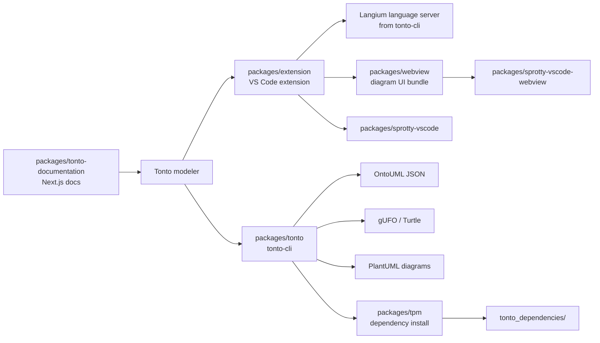

# Tonto

Tonto is a textual DSL for creating OntoUML models grounded in the Unified Foundational Ontology (UFO). It gives ontology projects a source-controlled, code-like format while keeping the modeling concepts explicit enough for validation, transformation, visualization, and reuse.

The repository is an npm workspace that contains the Tonto language and CLI, the VS Code extension, the package manager, the documentation site, and the diagram/webview integration used by the extension.

## What Tonto Provides

- Textual syntax for OntoUML/UFO constructs such as kinds, roles, phases, relators, datatypes, enumerations, relations, and generalization sets.
- A Langium-based language server for validation, completion, hover information, semantic highlighting, formatting, references, and editor integrations.
- CLI commands for project initialization, JSON generation/import, local validation, gUFO transformation, and PlantUML diagram generation.
- A VS Code extension with `.tonto` editing, command views, diagram previews, PlantUML previews, and optional `.tontodiagram` editing.
- TPM, the Tonto Package Manager, for installing Git-based ontology dependencies declared in `tonto.json`.
- A self-hosted documentation site built from the repository content.

## Workspace Map



## Packages

| Package | npm workspace | Purpose |
|---|---|---|
| [Tonto CLI and language](packages/tonto/README.md) | `tonto-cli` | Grammar, generated AST, language server services, CLI commands, validators, import/export, and PlantUML generation. |
| [VS Code extension](packages/extension/README.md) | `tonto` | Marketplace extension, language client, command views, project commands, and diagram integration. |
| [Tonto Package Manager](packages/tpm/README.md) | `tonto-package-manager` | Git-based ontology dependency installation from `tonto.json`. |
| [Documentation site](packages/tonto-documentation/README.md) | `tonto-documentation` | Next.js documentation site and GitHub Pages export. |
| [Tonto diagram webview](packages/webview/README.md) | `tonto-sprotty-webview` | Private React/Vite webview bundle used by the extension for diagrams and `.tontodiagram` editing. |
| [Sprotty VS Code host](packages/sprotty-vscode/README.md) | `sprotty-vscode` | Host-side Sprotty/VS Code integration library vendored for the extension. |
| [Sprotty webview runtime](packages/sprotty-vscode-webview/README.md) | `sprotty-vscode-webview` | Webview-side Sprotty runtime library vendored for the diagram UI. |

## Requirements

- Node.js and npm. Use Node 24 or newer when developing the whole workspace because the documentation package declares `node >=24.0.0`.
- npm 7.7.0 or newer for workspace support.
- VS Code when developing or testing the extension.
- Git when using TPM dependency installation.

Some publishable packages declare lower runtime minimums, but Node 24 keeps the full monorepo build and documentation workflow aligned.

## Install

From the repository root:

```bash
npm install
```

## Common Commands

```bash
npm run build
npm run watch
npm run lint
npm run test
npm run docs:dev
npm run docs:check
```

Useful package-scoped commands:

```bash
npm run langium:generate
npm run build --workspace=tonto-cli
npm run build --workspace=tonto
npm run build --workspace=tonto-sprotty-webview
npm run build --workspace=tonto-documentation
```

## Running the Extension Locally

1. Install dependencies from the repository root.
2. Run the default VS Code build task with `Cmd+Shift+B`, or run `npm run watch`.
3. Open the debug panel and launch `Run Extension`.
4. In the Extension Development Host, open or create a `.tonto` file.

The extension starts the language server from the extension bundle and registers commands for JSON generation, JSON import, validation, gUFO transformation, TPM install, project initialization, guidance generation, semantic token color setup, and diagram previews.

## CLI Quick Start

After building or installing `tonto-cli`, create or inspect a project with:

```bash
tonto-cli init
tonto-cli generate .
tonto-cli validate .
tonto-cli validate . --with-api
tonto-cli transform .
tonto-cli plantuml . --per-package
```

See [packages/tonto/README.md](packages/tonto/README.md) for the complete command table and syntax overview.

## Project Structure

A typical Tonto project contains:

```text
my-ontology/
|-- src/
|   `-- main.tonto
|-- tonto.json
|-- tonto_dependencies/
`-- generated/
```

Minimal `.tonto` example:

```tonto
package university

kind Person {
    name: string
}

role Student specializes Person
kind Course {
    code: string
}

@material relation Student [0..*] -- enrollsIn -- [0..*] Course
```

## Documentation

The documentation site lives in [packages/tonto-documentation](packages/tonto-documentation/README.md).

```bash
npm run docs:dev
npm run docs:check
```

The GitHub Pages workflow builds the static site from the documentation workspace.

## Packaging And Publishing

Package the VS Code extension from `packages/extension`:

```bash
npm run package --workspace=tonto
```

Publish commands exist in individual package workspaces and require the appropriate npm or VS Code Marketplace credentials:

```bash
npm run publish --workspace=tonto-cli
npm run publish --workspace=tonto
```

## License

Distributed under the MIT License. See [LICENSE](LICENSE) for more information.

## Contact

Matheus Lenke Coutinho - matheus.l.coutinho@edu.ufes.br - [LinkedIn](https://www.linkedin.com/in/matheus-lenke-coutinho-492a4b15a/) - [GitHub](https://github.com/matheuslenke)
