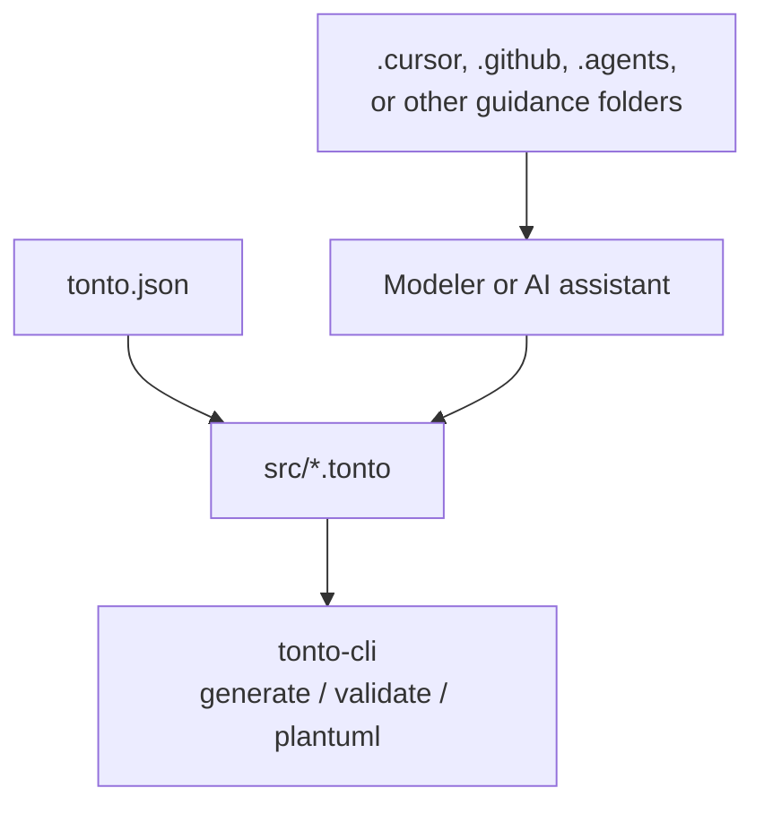

# Tonto Guidance Example Project

This example shows the project structure created by the Tonto project initializer when guidance files are included. It is intended as a small, readable starting point for modeling a domain with Tonto and for configuring editor or agentic IDE assistance around the ontology.

## What This Example Contains

- A `tonto.json` manifest with project metadata.
- `.tonto` source files in the project `src` folder.
- Guidance files for tools that can use project instructions while editing the ontology.
- A README template that explains the generated project to new users.

## Project Shape



## What Is Tonto?

Tonto is a textual modeling language for creating well-founded ontologies based on the Unified Foundational Ontology (UFO). A Tonto project uses `.tonto` files to describe packages, classes, attributes, relations, datatypes, enumerations, and generalization sets.

## Basic Modeling Pattern

Each `.tonto` file declares one package:

```tonto
package animals
```

Classes represent domain concepts. Use OntoUML/UFO stereotypes such as `kind`, `subkind`, `phase`, and `role` to make the ontological nature explicit.

```tonto
kind Animal {
    birthDate: date
}

subkind Cat specializes Animal
subkind Dog specializes Animal
```

Datatypes define structured values:

```tonto
datatype OwnerDetails {
    name: string
    address: string
}
```

Relations connect classes:

```tonto
kind Person {
    name: string
}

@material relation Person [0..*] -- owns -- [0..*] Animal
```

## Useful Commands

Run commands from the generated project root:

```bash
tonto-cli generate .
tonto-cli validate .
tonto-cli plantuml .
```

Initialize a new project with guidance files:

```bash
tonto-cli init
```

Then choose the desired editor or agentic IDE guidance target when prompted.

## Guidance Files

Guidance files help editors or AI assistants follow Tonto syntax and OntoUML/UFO modeling conventions. Depending on the selected target, they may be generated under folders such as `.cursor/rules`, `.github`, `.codex`, `.claude`, or `.agents`.

Keep the guidance folder at the root of the workspace so the corresponding tool can discover it.
