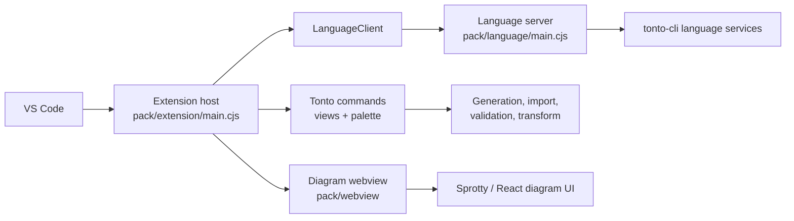

# Tonto VS Code Extension

`packages/extension` contains the VS Code extension published as `tonto`. It connects the editor UI to the Tonto language server, CLI-style project commands, TPM, PlantUML previews, and the bundled diagram webview.

For user-facing guides, see the documentation site in [packages/tonto-documentation](../tonto-documentation/README.md).

## Features

- `.tonto` language registration, syntax highlighting, semantic tokens, and language configuration.
- Langium language client/server activation for diagnostics, completion, hover, references, formatting, and workspace updates.
- Tonto activity bar and Explorer command views.
- Commands for JSON generation, JSON import, validation, gUFO transformation, TPM install, project initialization, guidance generation, and semantic token color setup.
- Optional automatic folding for multilingual `label` and `description` blocks.
- PlantUML diagram preview/export commands.
- Sprotty-based diagram preview and optional `.tontodiagram` editor.

## Runtime Shape



## Commands

The extension contributes these command IDs:

| Command | Title |
|---|---|
| `tonto.diagram.open` | Open Tonto Diagram |
| `tonto.diagram.createFile` | New Diagram From Current Model |
| `tonto.diagram.fit` | Fit to Screen |
| `tonto.diagram.center` | Center selection |
| `tonto.diagram.delete` | Delete selected element |
| `tonto.diagram.export` | Export diagram to SVG |
| `tonto.diagram.plantuml.open` | Open PlantUML Diagram |
| `tonto.diagram.plantuml.openProject` | Open Ontology PlantUML Diagram |
| `tonto.diagram.plantuml.export` | Export PlantUML |
| `tonto.generateJSON` | Transform Tonto -> JSON |
| `tonto.generateTonto` | Transform JSON -> Tonto |
| `tonto.validateModel` | Validate Model |
| `tonto.transformModel` | Transform to GUFO |
| `tonto.tpm.install` | Install Packages (TPM) |
| `tonto.initProject` | Init new Tonto project |
| `tonto.addGuidances` | Add Guidances to project (Work with LLMs) |
| `tonto.addSkill` | Add Tonto Skill to project |
| `tonto.addSemanticTokenColors` | Add Semantic Token Colors to User Settings |
| `tonto.editor.toggleLabelAndDescriptionFolding` | Toggle Label and Description Folding |

## Configuration

The `.tontodiagram` editor is feature-gated through:

```json
{
  "tonto.features.tontodiagram.enabled": true
}
```

Multiline `label` and `description` blocks can be folded automatically when a
Tonto editor becomes active:

```json
{
  "tonto.editor.autoFoldLabelsAndDescriptions": true
}
```

The setting is disabled by default and can also be changed with **Tonto: Toggle
Label and Description Folding**. Folding changes only the editor presentation;
it does not modify the `.tonto` document or generated ontology artifacts.

## Development

From the repository root:

```bash
npm install
npm run build --workspace=tonto
npm run watch --workspace=tonto
```

The extension build also builds the private webview package:

```bash
npm --prefix packages/webview run build
node packages/extension/esbuild.mjs
```

To run locally in VS Code:

1. Open this repository in VS Code.
2. Run the default build task or `npm run watch --workspace=tonto`.
3. Launch `Run Extension` from the debug panel.
4. Open a `.tonto` file in the Extension Development Host.

## Packaging

```bash
npm run package --workspace=tonto
```

Publishing requires VS Code Marketplace credentials:

```bash
npm run publish --workspace=tonto
```

## License

Distributed under the MIT License. See the repository root [LICENSE](../../LICENSE) file for more information.
