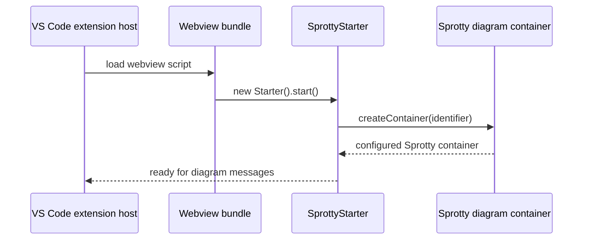

# Sprotty VS Code Webview Runtime

`packages/sprotty-vscode-webview` contains webview-side runtime helpers for displaying [Sprotty](https://www.npmjs.com/package/sprotty) diagrams inside VS Code. In this repository it supports the Tonto diagram UI that is bundled into the VS Code extension.

This package is paired with [packages/sprotty-vscode](../sprotty-vscode/README.md), which runs on the extension-host side.

## Runtime Flow



## Basic Usage

Implement a subclass of `SprottyStarter` and instantiate it in the webview entry module:

```typescript
export class ExampleSprottyStarter extends SprottyStarter {
    createContainer(diagramIdentifier: SprottyDiagramIdentifier) {
        return createExampleDiagramContainer(diagramIdentifier.clientId);
    }
}

new ExampleSprottyStarter().start();
```

`createExampleDiagramContainer` should create an Inversify container with the Sprotty modules and viewer options required by the diagram. Use the `clientId` in the Sprotty `baseDiv` and `hiddenDiv` IDs so multiple diagrams can coexist safely.

For diagrams connected to a language server, use `SprottyLspEditStarter`.

## Role In Tonto

- Receives diagram messages from the extension host.
- Starts the Sprotty client runtime inside the VS Code webview.
- Supplies webview-side messaging and diagram startup helpers.
- Is consumed by the private `tonto-sprotty-webview` package in `packages/webview`.

## Development

From the repository root:

```bash
npm run build --workspace=sprotty-vscode-webview
npm run watch --workspace=sprotty-vscode-webview
```

The package emits TypeScript output to `lib`.

## License

This package keeps the upstream Sprotty integration license: `(EPL-2.0 OR GPL-2.0 WITH Classpath-exception-2.0)`.
