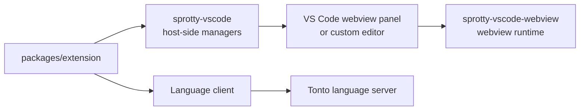

# Sprotty VS Code Host Integration

`packages/sprotty-vscode` contains host-side glue code for embedding [Sprotty](https://www.npmjs.com/package/sprotty) diagrams in VS Code. In this repository it is used by the Tonto extension to manage diagram webviews and communicate with the language-server-backed diagram model.

This package is based on the Eclipse Sprotty VS Code integration library and is kept in the monorepo so the Tonto extension can build and package the diagram integration with the rest of the workspace.

## Role In Tonto



## Main Concepts

- `WebviewPanelManager` manages Sprotty diagrams opened as VS Code webview panels.
- `SprottyEditorProvider` supports custom editor integrations.
- `SprottyViewProvider` supports diagrams inside VS Code side or bottom views.
- LSP variants connect the diagram lifecycle to a language client when diagrams are backed by a language server.
- `registerDefaultCommands` wires commands such as open, fit, center, export, and delete.

## Minimal Host Setup

```typescript
export function activate(context: vscode.ExtensionContext) {
    const webviewPanelManager = new WebviewPanelManager({
        extensionUri: context.extensionUri,
        defaultDiagramType: "mydiagram",
        supportedFileExtensions: [".mydiagram"]
    });
}
```

When the diagram is backed by a language server, use the LSP manager/provider variants and pass the configured VS Code language client.

## Expected Webview Bundle

The default host-side implementation expects the webview bundle to be available inside the extension package. Tonto's extension builds its diagram webview from `packages/webview` into `packages/extension/pack/webview`.

## Development

From the repository root:

```bash
npm run build --workspace=sprotty-vscode
npm run watch --workspace=sprotty-vscode
```

The package emits TypeScript output to `lib`.

## License

This package keeps the upstream Sprotty integration license: `(EPL-2.0 OR GPL-2.0 WITH Classpath-exception-2.0)`.
