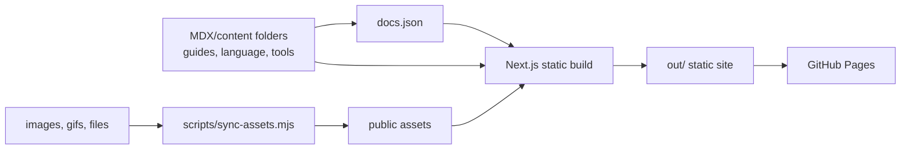

# Tonto Documentation

`packages/tonto-documentation` contains the self-hosted Tonto documentation site. It is built with Next.js, Tailwind CSS, MDX-oriented content files, and shadcn/ui-style components.

The content folders and `docs.json` are the source of truth for navigation and page content.

## Content Structure

```text
packages/tonto-documentation/
|-- app/
|-- components/
|-- guides/
|-- language/
|-- llm-assistance/
|-- reference/
|-- tools/
|-- docs.json
`-- scripts/sync-assets.mjs
```

## Build Flow



## Local Development

From the repository root:

```bash
npm run docs:dev
```

Or directly in the workspace:

```bash
npm run dev --workspace=tonto-documentation
```

The documentation package declares `node >=24.0.0`.

## Build And Preview

Create the production export:

```bash
npm run build --workspace=tonto-documentation
```

Preview the generated static site:

```bash
npm run preview --workspace=tonto-documentation
```

The generated static site is written to:

```text
packages/tonto-documentation/out
```

## Checks

```bash
npm run docs:check
npm run typecheck --workspace=tonto-documentation
```

`docs:check` runs the documentation build from the repository root. `typecheck` runs `tsc --noEmit` for the documentation application.

## GitHub Pages

The `documentation.yml` workflow builds and deploys the static site when documentation changes land on `main`.

Repository settings:

1. Open **Settings -> Pages**.
2. Set **Build and deployment -> Source** to **GitHub Actions**.

The workflow configures `NEXT_PUBLIC_BASE_PATH=/Tonto` for the repository Pages URL. If the repository name changes, update `NEXT_PUBLIC_BASE_PATH` in `.github/workflows/documentation.yml`.

## License

Distributed under the MIT License. See the repository root [LICENSE](../../LICENSE) file for more information.
