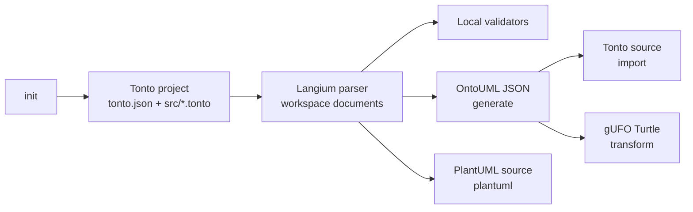

# Tonto CLI And Language Package

`packages/tonto` contains the Tonto grammar, generated language services, validation rules, diagram model generation, and the `tonto-cli` command-line interface.

This is the core package used by the VS Code extension, the webview, TPM, tests, and external users that install `tonto-cli` from npm.

## Responsibilities

- Define the Tonto grammar with Langium.
- Provide language services for parsing, validation, formatting, references, completion, hover information, and semantic tokens.
- Convert Tonto projects to OntoUML JSON.
- Import OntoUML JSON back into Tonto source files.
- Validate projects locally, with optional OntoUML API validation.
- Transform models to gUFO/Turtle through the OntoUML toolchain.
- Generate PlantUML diagram source from a Tonto project.
- Initialize new Tonto projects and optional guidance files for agentic IDE workflows.

## Command Flow



## Install

From npm:

```bash
npm install -g tonto-cli
```

From this repository:

```bash
npm install
npm run build --workspace=tonto-cli
```

## CLI Commands

| Command | Purpose |
|---|---|
| `tonto-cli init` | Initialize a new Tonto project. Use `--destination <dir>` and `--template <template>` for non-interactive setup. |
| `tonto-cli generate <dir>` | Generate OntoUML JSON from a project. Use `--destination <dir>` to choose the output folder. |
| `tonto-cli generateSingle <file>` | Generate JSON from a single `.tonto` file. |
| `tonto-cli import <file>` | Generate a Tonto project from an OntoUML JSON file. |
| `tonto-cli importSingle <file>` | Generate a single Tonto output from an OntoUML JSON file. |
| `tonto-cli validate <dir>` | Validate a project locally. Add `--with-api` to also call the OntoUML API. |
| `tonto-cli transform <dir>` | Transform a Tonto project to gUFO/Turtle through the OntoUML toolchain. |
| `tonto-cli plantuml <dir>` | Generate PlantUML diagram source. Supports `--destination`, `--per-package`, `--no-external-references`, and `--layout`. |
| `tonto-cli add-skill` | Add the Tonto ontology skill files for supported editor and agentic IDE targets. |

Examples:

```bash
tonto-cli init --destination my-ontology
tonto-cli generate my-ontology --destination generated
tonto-cli validate my-ontology --with-api
tonto-cli plantuml my-ontology --per-package --layout left-to-right
```

## Language Overview

Every `.tonto` file declares one package:

```tonto
package university
```

Tonto supports OntoUML/UFO stereotypes for sortals, non-sortals, relators, qualities, perdurants, higher-order types, and neutral classes.

```tonto
package university

kind Person {
    name: string
    birthDate: date [0..1]
}

role Student specializes Person
role Professor specializes Person

kind Course {
    code: string
    title: string
}

relator Enrollment {
    @mediation [1] -- [1] Student
    @mediation [1] -- [1] Course
}

@material relation Student [0..*] -- enrollsIn -- [0..*] Course
```

## Common Declarations

### Classes

```tonto
kind Person
subkind Employee specializes Person
phase Child specializes Person
role Student specializes Person
relator Employment
```

### Datatypes And Enumerations

```tonto
datatype Address {
    street: string
    city: string
}

enum EyeColor { Blue, Green, Brown, Black }
```

Built-in datatypes include `string`, `number`, `boolean`, `date`, `time`, and `datetime`.

### Attributes

```tonto
kind Person {
    name: string [1]
    nicknames: string [*] { ordered }
    nationalId: string [0..1] { const }
}
```

### Relations

```tonto
kind University {
    @componentOf [1] <>-- hasDepartments -- [1..*] Department
}

@mediation relation Employment [1] -- [1] Employee
```

### Generalization Sets

```tonto
disjoint complete genset PersonLifePhase where Child, Adult specializes Person

genset PersonRoles {
    general Person
    specifics Student, Professor
}
```

## Development

From the repository root:

```bash
npm run langium:generate
npm run build --workspace=tonto-cli
npm run test --workspace=tonto-cli
npm run watch --workspace=tonto-cli
```

The grammar entry point is `src/language/tonto.langium`. Generated language files are checked in under `src/language/generated`.

## License

Distributed under the MIT License. See the repository root [LICENSE](../../LICENSE) file for more information.
