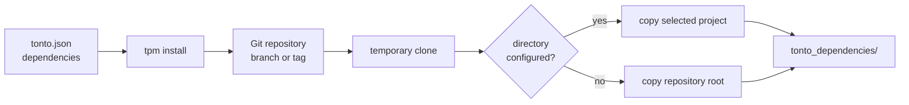

# Tonto Package Manager

`packages/tpm` contains the `tpm` command-line tool. TPM installs ontology dependencies declared in a Tonto project manifest (`tonto.json`) from Git repositories into the local `tonto_dependencies` folder.

Use TPM when a Tonto project depends on reusable ontology packages that live in another Git repository, a subdirectory of a repository, a branch, or a version tag.

## Dependency Flow



## Manifest Format

```json
{
  "projectName": "Aguiar2019ooco",
  "displayName": "Aguiar 2019 Object Oriented Example",
  "publisher": "Aguiar",
  "version": "1.0.0",
  "license": "MIT",
  "dependencies": {
    "SWO": {
      "url": "https://github.com/example/tonto-example-models.git",
      "directory": "SWO",
      "branch": "feature/test-tonto-reference"
    },
    "SPO": {
      "url": "https://github.com/example/tonto-example-models.git",
      "directory": "SPO",
      "version": "1.0.1"
    }
  },
  "outFolder": "generated"
}
```

Dependency fields:

| Field | Required | Meaning |
|---|---|---|
| `url` | Yes | Git repository URL. |
| `directory` | No | Subdirectory inside the repository that contains the dependency project. |
| `branch` | No | Branch to clone. |
| `version` | No | Git tag to clone. |

If neither `branch` nor `version` is defined, TPM clones the repository's default branch.

## Commands

Install dependencies for the current project:

```bash
tpm install
```

Install dependencies for another project directory:

```bash
tpm install --dir path/to/project
tpm i --dir path/to/project
```

Add a dependency to `tonto.json`:

```bash
tpm add . \
  --name SharedOntology \
  --url https://github.com/example/shared-ontology.git \
  --version 1.0.0 \
  --dir ontology-package
```

Show command help:

```bash
tpm help
tpm install help
tpm add help
```

## Development

From the repository root:

```bash
npm run build --workspace=tonto-package-manager
npm run test --workspace=tonto-package-manager
npm run watch --workspace=tonto-package-manager
```

The package exposes the `tpm` binary from `bin/cli.js` and imports the Tonto CLI package for manifest and project support.

## Troubleshooting

- Delete `tonto_dependencies` and run `tpm install` again if a dependency checkout becomes stale.
- Use `version` only when the referenced Git repository has a matching tag.
- Use `directory` when the dependency repository contains more than one Tonto project.
- Make sure Git is installed and available on `PATH`.

## License

Distributed under the MIT License. See the repository root [LICENSE](../../LICENSE) file for more information.
