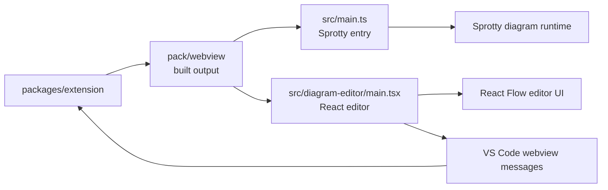

# Tonto Diagram Webview

`packages/webview` contains the private React/Vite webview bundle used by the Tonto VS Code extension. It renders diagram previews and the `.tontodiagram` editor UI inside VS Code webviews.

This package is not published independently. The extension build compiles it into `packages/extension/pack/webview`.

## Runtime Flow



## Main Areas

| Path | Purpose |
|---|---|
| `src/main.ts` | Webview entry point for diagram previews. |
| `src/di.config.ts` | Sprotty dependency-injection setup. |
| `src/views.tsx` and `src/html-views.tsx` | Rendered diagram views. |
| `src/diagram-editor/` | React-based `.tontodiagram` editor. |
| `src/styles.css` and `css/` | Webview styling. |

## Development

From the repository root:

```bash
npm run build --workspace=tonto-sprotty-webview
npm run watch --workspace=tonto-sprotty-webview
```

The extension workspace also builds this package:

```bash
npm run build --workspace=tonto
```

## Output

The Vite build writes files for the extension to:

```text
packages/extension/pack/webview
```

Do not edit generated files in `pack/webview` directly. Change the source files in `packages/webview/src` and rebuild.

## License

This package uses the Sprotty integration license declared in `package.json`: `(EPL-2.0 OR GPL-2.0 WITH Classpath-exception-2.0)`.
